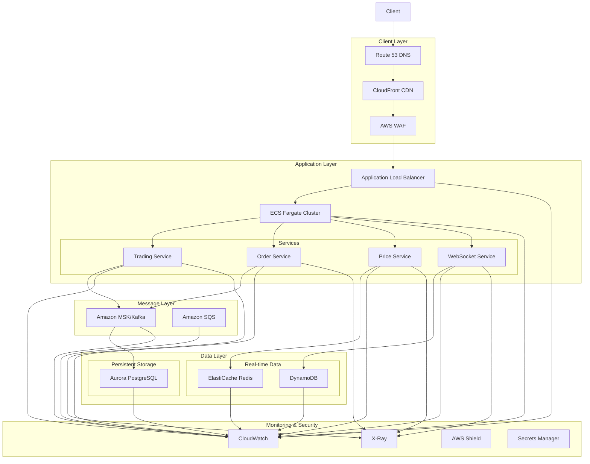

Provide your solution here:

# High-Availability Trading System Architecture

## Overview Diagram

## Service Selection and Rationale

### 1. Client Layer
- **Amazon CloudFront**
  - Purpose: Global content delivery and DDoS protection
  - Alternative: Cloudflare (rejected due to AWS integration benefits)
- **Route 53**
  - Purpose: DNS routing with health checks and failover
  - Alternative: None (AWS native service required for best integration)
- **AWS WAF**
  - Purpose: Web application firewall for security
  - Alternative: ModSecurity (rejected due to maintenance overhead)

### 2. Application Layer
- **Application Load Balancer**
  - Purpose: Layer 7 load balancing with WebSocket support
  - Alternative: NGINX (rejected due to management overhead)
- **ECS Fargate**
  - Purpose: Container orchestration without server management
  - Alternative: EKS (rejected for initial setup due to complexity)
  - Services:
    - Trading Service: Core order matching engine
    - Order Service: Order management and validation
    - Price Service: Real-time price updates
    - WebSocket Service: Real-time client communications

### 3. Data Layer
- **ElastiCache Redis**
  - Purpose: In-memory price data and order book
  - Alternative: Memcached (rejected due to lack of persistence)
- **DynamoDB**
  - Purpose: Real-time user sessions and WebSocket connections
  - Alternative: MongoDB (rejected due to operational overhead)
- **Aurora PostgreSQL**
  - Purpose: Persistent storage for orders and transactions
  - Alternative: RDS MySQL (rejected due to lower performance)

### 4. Message Layer
- **Amazon MSK (Managed Kafka)**
  - Purpose: Event streaming for order processing
  - Alternative: RabbitMQ (rejected due to scale requirements)
- **Amazon SQS**
  - Purpose: Asynchronous task processing
  - Alternative: Redis queues (rejected due to durability concerns)

## Scaling Strategy

### Current Setup (500 RPS, <100ms p99)
1. **Application Layer**
   - ECS Fargate: Auto-scaling based on CPU/Memory (initial 10 tasks)
   - ALB: Configured for WebSocket and HTTP/2

2. **Data Layer**
   - Redis: r6g.xlarge with read replicas
   - DynamoDB: On-demand capacity
   - Aurora: db.r6g.2xlarge with read replicas

3. **Message Layer**
   - MSK: 3 brokers kafka.m5.large
   - SQS: Standard queues with auto-scaling

### Future Scaling (Beyond Current Requirements)

1. **Geographic Expansion**
   - Deploy to multiple AWS regions
   - Use Global Accelerator for routing
   - Implement cross-region data replication

2. **Performance Optimization**
   - Upgrade instance types
   - Add Redis cluster mode
   - Implement database sharding
   - Consider moving to EKS for more granular control

3. **Resilience Improvements**
   - Multi-region active-active setup
   - Cross-region Aurora Global Database
   - Enhanced monitoring and automated failover

## High Availability Features

1. **Multi-AZ Deployment**
   - All services deployed across 3 Availability Zones
   - Automatic failover for databases
   - Load balancer health checks

2. **Data Redundancy**
   - Aurora: Synchronous replication
   - Redis: Multi-AZ with automatic failover
   - DynamoDB: Global tables for regional redundancy

3. **Fault Tolerance**
   - Circuit breakers in application code
   - Retry mechanisms with exponential backoff
   - Dead letter queues for failed messages

## Cost-Effectiveness Measures

1. **Resource Optimization**
   - Auto-scaling based on actual load
   - Spot instances for non-critical workloads
   - Reserved instances for predictable workloads

2. **Data Lifecycle Management**
   - Data archival to S3 for cold storage
   - TTL for DynamoDB items
   - Log retention policies

3. **Performance/Cost Balance**
   - Caching strategies to reduce database load
   - Compression for network traffic
   - Right-sized instances based on metrics
